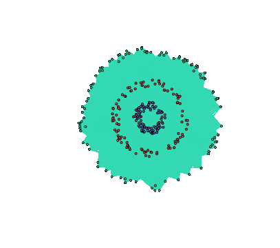

<!-- README.md is generated from README.Rmd. Please edit that file -->

```{r, echo = FALSE}
library(knitr)
opts_chunk$set(
  collapse = TRUE,
  comment = "#>",
  fig.path = "man/figures/README-",
  fig.align = "center",
  fig.retina = 2,
  out.width = "75%",
  dpi = 96
)
knit_hooks$set(pngquant = hook_pngquant)
```

[](https://cran.r-project.org/package=spectralGraphTopology)
[](https://cran.r-project.org/package=spectralGraphTopology)

[](https://www.rcpp.org/)

[](https://codecov.io/gh/mirca/spectralGraphTopology)
[](https://travis-ci.org/mirca/spectralGraphTopology)
[](https://ci.appveyor.com/project/mirca/spectralgraphtopology-j05c9)
[](https://circleci.com/gh/mirca/spectralGraphTopology)
[](https://hub.docker.com/r/mirca/spectralgraphtopology/)
[](https://dev.azure.com/jvmirca/spectralGraphTopology/_build/latest?definitionId=1&branchName=master)

<a href="https://mirca.github.io/spectralGraphTopology"></a>

**spectralGraphTopology** provides estimators to learn k-component, bipartite,
and k-component bipartite graphs from data by imposing spectral constraints
on the eigenvalues and eigenvectors of the Laplacian and adjacency matrices.
Those estimators leverages spectral properties of the graphical models as a
prior information, which turn out to play key roles in unsupervised machine
learning tasks such as community detection.

**Documentation**: [**https://mirca.github.io/spectralGraphTopology**](https://mirca.github.io/spectralGraphTopology).

## Installation

From inside an R session, type:
```{r, eval = FALSE}
> install.packages("spectralGraphTopology")
```

Alternatively, you can install the development version from GitHub:
```{r, eval = FALSE}
> devtools::install_github("dppalomar/spectralGraphTopology")
```

#### Microsoft Windows
On MS Windows environments, make sure to install the most recent version of ``Rtools``.

#### macOS
**spectralGraphTopology** depends on [`RcppArmadillo`](https://github.com/RcppCore/RcppArmadillo) which requires [`gfortran`](https://CRAN.R-project.org/bin/macosx/tools/).

## Usage: clustering
We illustrate the usage of the package with simulated data, as follows:
```{r plot_k_component, message=FALSE}
library(spectralGraphTopology)
library(clusterSim)
library(igraph)
set.seed(42)

# generate graph and data
n <- 50  # number of nodes per cluster
twomoon <- clusterSim::shapes.two.moon(n)  # generate datapoints
k <- 2  # number of components

# estimate underlying graph
S <- crossprod(t(twomoon$data))
graph <- learn_k_component_graph(S, k = k, beta = .5, verbose = FALSE, abstol = 1e-3)

# plot
# build network
net <- igraph::graph_from_adjacency_matrix(graph$Adjacency, mode = "undirected", weighted = TRUE)
# colorify nodes and edges
colors <- c("#706FD3", "#FF5252")
V(net)$cluster <- twomoon$clusters
E(net)$color <- apply(as.data.frame(get.edgelist(net)), 1,
                      function(x) ifelse(V(net)$cluster[x[1]] == V(net)$cluster[x[2]],
                                        colors[V(net)$cluster[x[1]]], '#000000'))
V(net)$color <- colors[twomoon$clusters]
# plot nodes
plot(net, layout = twomoon$data, vertex.label = NA, vertex.size = 3)
```

## Contributing
We welcome all sorts of contributions. Please feel free to open an issue
to report a bug or discuss a feature request.

## Citation
If you made use of this software please consider citing:

- J. V. de Miranda Cardoso, D. P. Palomar (2019). spectralGraphTopology: Learning Graphs from
  Data via Spectral Constraints. R package version 0.1.0. <https://CRAN.R-project.org/package=spectralGraphTopology>

- S. Kumar, J. Ying, J. V. de Miranda Cardoso, and D. P. Palomar (2019). A unified framework
  for structured graph learning via spectral constraints. <https://arxiv.org/abs/1904.09792>

In case you made use of the function `cluster_k_component_graph`, consider citing:

- N., Feiping, W., Xiaoqian, J., Michael I., and H., Heng. (2016).
  The Constrained Laplacian Rank Algorithm for Graph-based Clustering,
  AAAI'16. <https://dl.acm.org/citation.cfm?id=3016100.3016174>

## Links
Package: [CRAN](https://CRAN.R-project.org/package=spectralGraphTopology) and [GitHub](https://github.com/dppalomar/spectralGraphTopology).

README file: [CRAN-readme](https://CRAN.R-project.org/package=spectralGraphTopology/readme/README.html)
and [GitHub-readme](https://github.com/dppalomar/spectralGraphTopology/blob/master/README.md).

Vignette: [CRAN-html-vignette](https://CRAN.R-project.org/package=spectralGraphTopology/vignettes/SpectralGraphTopology.html),
[CRAN-pdf-vignette](https://CRAN.R-project.org/package=spectralGraphTopology/vignettes/SpectralGraphTopology-pdf.pdf),
[GitHub-html-vignette](https://raw.githack.com/dppalomar/spectralGraphTopology/master/vignettes/SpectralGraphTopology.html)
