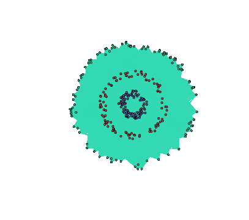

<p align="center">
  
</p>

`spectralGraphTopology`: learning the topology of graphs by leveraging spectral constraints.
Based on: S. Kumar, J. Ying, J. V. de Miranda Cardoso, and D. P. Palomar (2019). A unified framework
for structured graph learning via spectral constraints.

## Installation

From inside an R session, type:

```r
> devtools::install_github("dppalomar/spectralGraphTopology")
```

Alternatively, you can install the development version from GitHub:
```
$ git clone https://github.com/dppalomar/spectralGraphTopology.git
$ cd spectralGraphTopology
$ make build && make install
```

#### Microsoft Windows
On MS Windows environments, make sure to install the most recent version of ``Rtools``.

### Tests
To run unit tests, type on your favourite terminal:
```
$ cd spectralGraphTopology
$ Rscript -e "devtools::test()"
```

If any of the tests fail, please open a ticket [here](https://github.com/dppalomar/spectralGraphTopology/issues).


# Usage
We illustrate the usage of the package with simulated data, as follows:

```r
library(spectralGraphTopology)
library(clusterSim)
#> Loading required package: cluster
#> Loading required package: MASS
library(igraph)
#> 
#> Attaching package: 'igraph'
#> The following objects are masked from 'package:stats':
#> 
#>     decompose, spectrum
#> The following object is masked from 'package:base':
#> 
#>     union
set.seed(42)
# number of nodes per cluster
n <- 50
# generate datapoints
twomoon <- shapes.two.moon(n)
# number of components
k <- 2
# estimate underlying graph
S <- crossprod(t(twomoon$data))
graph <- learn_laplacian_matrix(S, k = k, beta = .5, verbose = FALSE, abstol = 1e-3)
# build network
net <- graph_from_adjacency_matrix(graph$Adjacency, mode = "undirected", weighted = TRUE)
# colorify nodes and edges
colors <- c("#706FD3", "#FF5252")
V(net)$cluster <- twomoon$clusters
E(net)$color <- apply(as.data.frame(get.edgelist(net)), 1,
                      function(x) ifelse(V(net)$cluster[x[1]] == V(net)$cluster[x[2]],
                                        colors[V(net)$cluster[x[1]]], '#000000'))
V(net)$color <- colors[twomoon$clusters]
# plot nodes
plot(net, layout = twomoon$data, vertex.label = NA, vertex.size = 3)
```


## Contributing
We welcome all sorts of contributions. Please feel free to open an issue
to report a bug or discuss a feature request.

## Links
Package: [GitHub](https://github.com/dppalomar/spectralGraphTopology)

README file: [GitHub-readme](https://rawgit.com/dppalomar/spectralGraphTopology/master/README.html)
