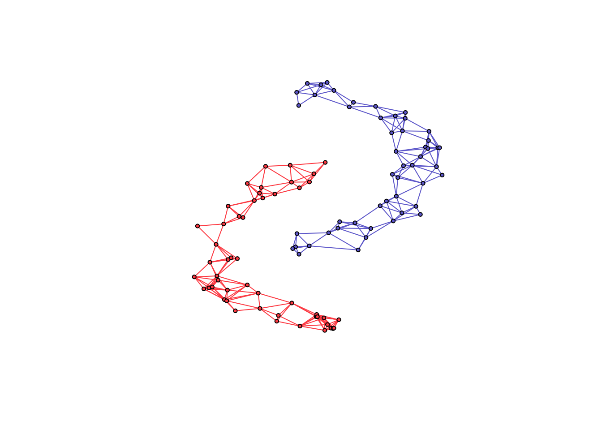

<!-- README.md is generated from README.Rmd. Please edit that file -->

spectralGraphTopology
=====================

[](https://cran.r-project.org/package=spectralGraphTopology)
[](https://cran.r-project.org/package=spectralGraphTopology)

[](http://www.rcpp.org/)

[](https://codecov.io/gh/mirca/spectralGraphTopology)
[](https://hub.docker.com/r/mirca/spectralgraphtopology/)

<a href="https://mirca.github.io/spectralGraphTopology"></a>

**spectralGraphTopology** provides estimators to learn k-component,
bipartite, and k-component bipartite graphs from data by imposing
spectral constraints on the eigenvalues and eigenvectors of the
Laplacian and adjacency matrices. Those estimators leverage spectral
properties of the graphical models as a prior information which turn out
to play key roles in unsupervised machine learning tasks such as
clustering.

**Documentation**:
[**https://mirca.github.io/spectralGraphTopology**](https://mirca.github.io/spectralGraphTopology).

Installation
------------

From inside an R session, type:

``` r
> install.packages("spectralGraphTopology")
```

Alternatively, you can install the development version from GitHub:

``` r
> devtools::install_github("dppalomar/spectralGraphTopology")
```

#### Microsoft Windows

On MS Windows environments, make sure to install the most recent version
of `Rtools`.

#### macOS

**spectralGraphTopology** depends on
[`RcppArmadillo`](https://github.com/RcppCore/RcppArmadillo) which
requires [`gfortran`](https://CRAN.R-project.org/bin/macosx/tools/).

Usage: clustering
-----------------

We illustrate the usage of the package with simulated data, as follows:

``` r
library(spectralGraphTopology)
library(clusterSim)
library(igraph)
set.seed(42)

# generate graph and data
n <- 50  # number of nodes per cluster
twomoon <- clusterSim::shapes.two.moon(n)  # generate data points
k <- 2  # number of components

# estimate underlying graph
S <- crossprod(t(twomoon$data))
graph <- learn_k_component_graph(S, k = k, beta = .25, verbose = FALSE, abstol = 1e-3)

# plot
# build network
net <- igraph::graph_from_adjacency_matrix(graph$adjacency, mode = "undirected", weighted = TRUE)
# colorify nodes and edges
colors <- c("#706FD3", "#FF5252")
V(net)$cluster <- twomoon$clusters
E(net)$color <- apply(as.data.frame(get.edgelist(net)), 1,
                      function(x) ifelse(V(net)$cluster[x[1]] == V(net)$cluster[x[2]],
                                        colors[V(net)$cluster[x[1]]], '#000000'))
V(net)$color <- colors[twomoon$clusters]
# plot nodes
plot(net, layout = twomoon$data, vertex.label = NA, vertex.size = 3)
```



Contributing
------------

We welcome all sorts of contributions. Please feel free to open an issue
to report a bug or discuss a feature request.

Citation
--------

If you made use of this software please consider citing:

-   J. V. de Miranda Cardoso, D. P. Palomar (2019).
    spectralGraphTopology: Learning Graphs from Data via Spectral
    Constraints.
    <a href="https://CRAN.R-project.org/package=spectralGraphTopology" class="uri">https://CRAN.R-project.org/package=spectralGraphTopology</a>

-   S. Kumar, J. Ying, J. V. de Miranda Cardoso, and D. P. Palomar
    (2020). [A unified framework for structured graph learning via
    spectral constraints](https://www.jmlr.org/papers/v21/19-276.html).
    Journal of Machine Learning Research (21), pages 1-60.

-   S. Kumar, J. Ying, J. V. de Miranda Cardoso, D. P. Palomar (2019).
    [Structured graph learning via Laplacian spectral
    constraints](https://papers.nips.cc/paper/9339-structured-graph-learning-via-laplacian-spectral-constraints.pdf).
    Advances in Neural Information Processing Systems.

In addition, consider citing the following bibliography according to
their implementation:

| **function**                          | **reference**                                                                                                                                                                                                                                                                                       |
|---------------------------------------|-----------------------------------------------------------------------------------------------------------------------------------------------------------------------------------------------------------------------------------------------------------------------------------------------------|
| `cluster_k_component_graph`           | N., Feiping, W., Xiaoqian, J., Michael I., and H., Heng. (2016). [The Constrained Laplacian Rank Algorithm for Graph-based Clustering](https://dl.acm.org/citation.cfm?id=3016100.3016174), AAAI’16.                                                                                                |
| `learn_laplacian_gle_mm`              | Licheng Zhao, Yiwei Wang, Sandeep Kumar, and Daniel P. Palomar, [Optimization Algorithms for Graph Laplacian Estimation via ADMM and MM](https://palomar.home.ece.ust.hk/papers/2019/ZhaoWangKumarPalomar-TSP2019.pdf), IEEE Trans. on Signal Processing, vol. 67, no. 16, pp. 4231-4244, Aug. 2019 |
| `learn_laplacian_gle_admm`            | Licheng Zhao, Yiwei Wang, Sandeep Kumar, and Daniel P. Palomar, [Optimization Algorithms for Graph Laplacian Estimation via ADMM and MM](https://palomar.home.ece.ust.hk/papers/2019/ZhaoWangKumarPalomar-TSP2019.pdf), IEEE Trans. on Signal Processing, vol. 67, no. 16, pp. 4231-4244, Aug. 2019 |
| `learn_combinatorial_graph_laplacian` | H. E. Egilmez, E. Pavez and A. Ortega, [Graph learning from data under Laplacian and structural constraints](https://ieeexplore.ieee.org/document/7979524), Journal of Selected Topics in Signal Processing, vol. 11, no. 6, pp. 825-841, Sept. 2017                                                |

Links
-----

Package:
[CRAN](https://CRAN.R-project.org/package=spectralGraphTopology) and
[GitHub](https://github.com/dppalomar/spectralGraphTopology)

README file:
[GitHub-readme](https://github.com/dppalomar/spectralGraphTopology/blob/master/README.md)

Vignette:
[GitHub-html-vignette](https://raw.githack.com/dppalomar/spectralGraphTopology/master/vignettes/SpectralGraphTopology.html),
[CRAN-html-vignette](https://cran.r-project.org/web/packages/spectralGraphTopology/vignettes/SpectralGraphTopology.html),
[NeurIPS’19 Promotional
slides](https://docs.google.com/viewer?url=https://github.com/dppalomar/spectralGraphTopology/raw/master/vignettes/NeurIPS19-promo-slides.pdf),
[NeurIPS’19 Promotional
video](https://www.youtube.com/watch?v=klAqFvyQx7k)
