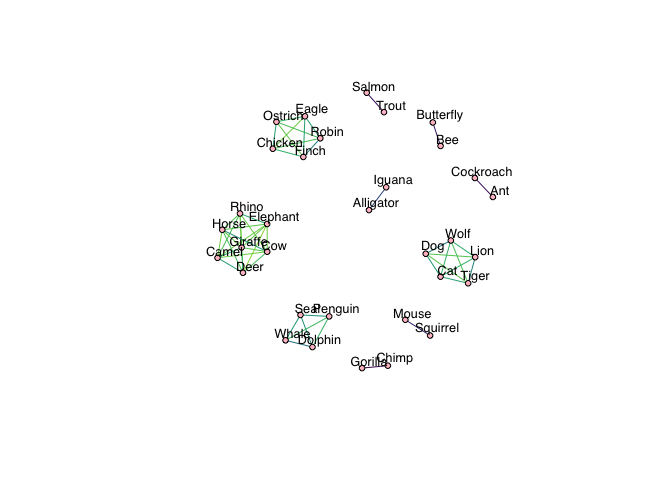

# Spatial datasets
{: .no_toc }

## Table of contents
{: .no_toc .text-delta }

1. TOC
{:toc}

---

## Animal dataset

``` r
library(viridis)
library(spectralGraphTopology)
library(igraph)

df <- read.csv("animals.txt", header = FALSE)
names <- matrix(unlist(read.csv("animals_names.txt", header = FALSE)))
Y <- matrix(as.numeric(unlist(df)), nrow = nrow(df))
n <- nrow(Y)
graph <- learn_laplacian_matrix(cov(t(Y)) + diag(1/3, n, n), w0 = "qp",
                                beta = 1, k = 10, verbose = FALSE)
net <- graph_from_adjacency_matrix(graph$Adjacency, mode = "undirected", weighted = TRUE)
colors <- viridis(50, begin = 0, end = 1, direction = -1)
c_scale <- colorRamp(colors)
E(net)$color = apply(c_scale(abs(E(net)$weight) / max(abs(E(net)$weight))), 1,
                     function(x) rgb(x[1]/255, x[2]/255, x[3]/255))
V(net)$color = "pink"
plot(net, vertex.label = names,
     vertex.size = 4,
     vertex.label.dist = 1,
     vertex.label.family = "Helvetica",
     vertex.label.cex = .8,
     vertex.label.color = "black")
```


