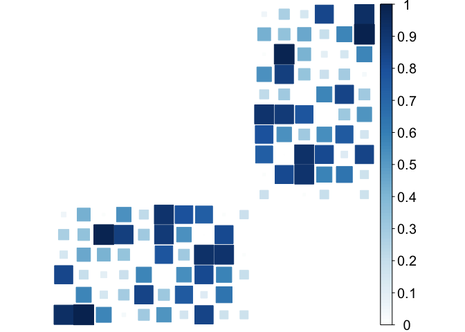
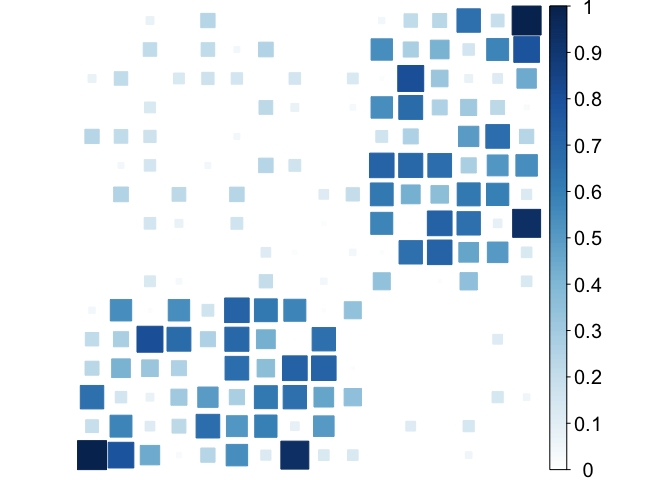
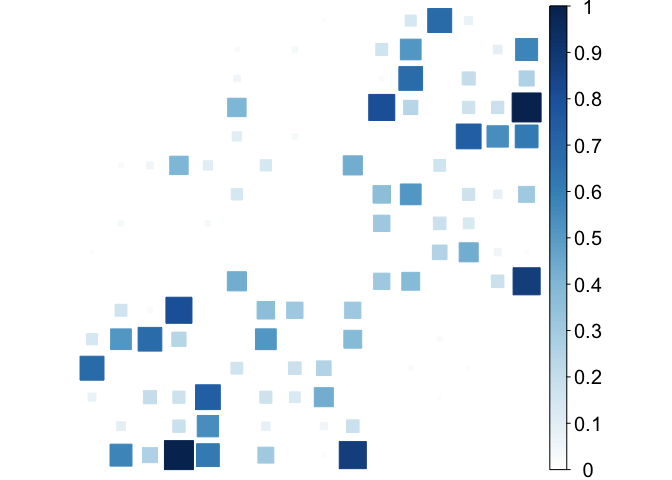
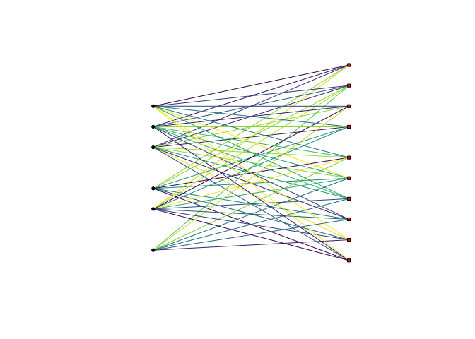

# Bipartite
{: .no_toc }

## Table of contents
{: .no_toc .text-delta }

1. TOC
{:toc}

---


``` r
library(spectralGraphTopology)
library(igraph)
library(viridis)
library(corrplot)
set.seed(42)

n1 <- 10
n2 <- 6
n <- n1 + n2
pc <- .9

bipartite <- sample_bipartite(n1, n2, type="Gnp", p = pc, directed=FALSE)
# randomly assign edge weights to connected nodes
E(bipartite)$weight <- runif(gsize(bipartite), min = 0, max = 1)
# get true Laplacian and Adjacency
Ltrue <- as.matrix(laplacian_matrix(bipartite))
Atrue <- diag(diag(Ltrue)) - Ltrue
# get samples
Y <- MASS::mvrnorm(100 * n, rep(0, n), Sigma = MASS::ginv(Ltrue))
# compute sample covariance matrix
S <- cov(Y)
# estimate Adjacency matrix
graph <- learn_bipartite_graph(S, z = 4, verbose = FALSE)
graph$Adjacency[graph$Adjacency < 1e-3] <- 0
# Plot Adjacency matrices: true, noisy, and estimated
corrplot(Atrue / max(Atrue), is.corr = FALSE, method = "square", addgrid.col = NA, tl.pos = "n", cl.cex = 1.25)
corrplot(graph$Adjacency / max(graph$Adjacency), is.corr = FALSE, method = "square", addgrid.col = NA, tl.pos = "n", cl.cex = 1.25)
# build networks
estimated_bipartite <- graph_from_adjacency_matrix(graph$Adjacency, mode = "undirected", weighted = TRUE)
V(estimated_bipartite)$type <- c(rep(0, 10), rep(1, 6))
la = layout_as_bipartite(estimated_bipartite)
colors <- viridis(20, begin = 0, end = 1, direction = -1)
c_scale <- colorRamp(colors)
E(estimated_bipartite)$color = apply(c_scale(E(estimated_bipartite)$weight / max(E(estimated_bipartite)$weight)), 1,
                          function(x) rgb(x[1]/255, x[2]/255, x[3]/255))
E(bipartite)$color = apply(c_scale(E(bipartite)$weight / max(E(bipartite)$weight)), 1,
                      function(x) rgb(x[1]/255, x[2]/255, x[3]/255))
la = la[, c(2, 1)]
# Plot networks: true and estimated
plot(bipartite, layout = la, vertex.color=c("red","black")[V(bipartite)$type + 1],
     vertex.shape = c("square", "circle")[V(bipartite)$type + 1],
     vertex.label = NA, vertex.size = 5)
plot(estimated_bipartite, layout = la, vertex.color=c("red","black")[V(estimated_bipartite)$type + 1],
     vertex.shape = c("square", "circle")[V(estimated_bipartite)$type + 1],
     vertex.label = NA, vertex.size = 5)
```

True adjacency             |  Estimated adjacency
:-------------------------:|:------------------------:
 | 

True graph                 |  Estimated graph
:-------------------------:|:-------------------------:
 | 
