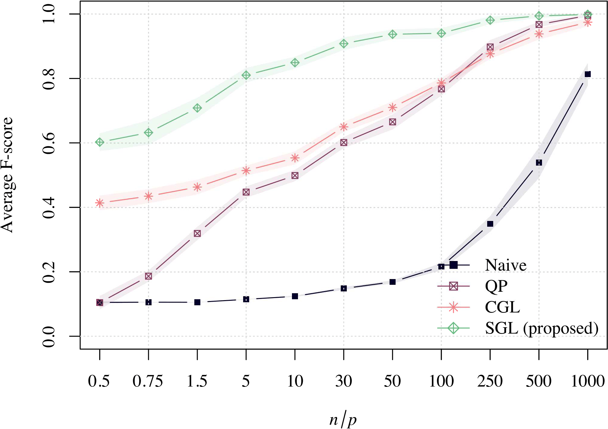
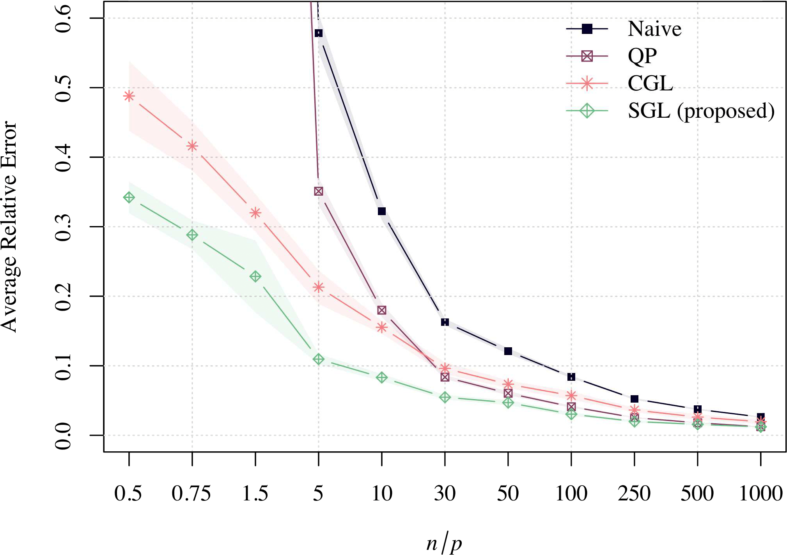
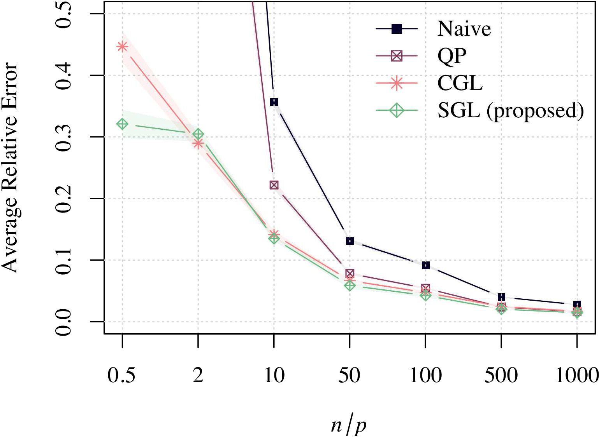
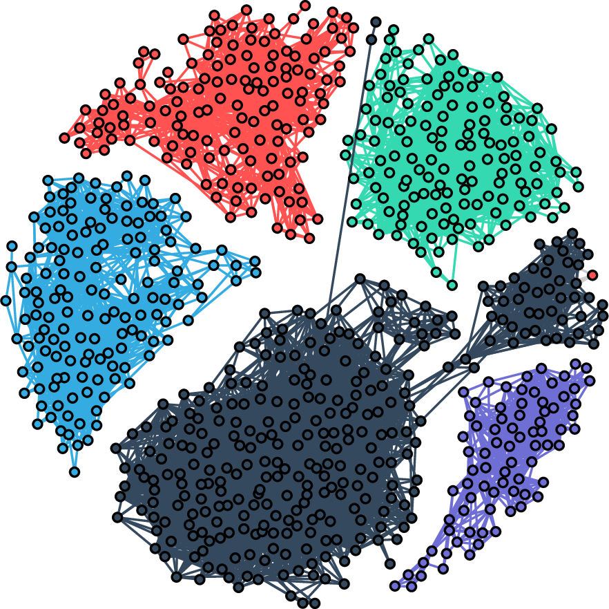

```{r, echo = FALSE}
library(knitr)
opts_chunk$set(
  collapse = TRUE,
  comment = "#>",
  fig.align = "center",
  fig.retina = 2,
  out.width = "75%",
  dpi = 96,
  pngquant = "--speed=1"
)
knit_hooks$set(pngquant = hook_pngquant)
#Help on bookdown: https://bookdown.org/yihui/bookdown/
#rmarkdown::render("vignettes/SpectralGraphTopology.Rmd", "all")
#rmarkdown::render("vignettes/SpectralGraphTopology.Rmd", "bookdown::html_document2")
#rmarkdown::render("vignettes/SpectralGraphTopology.Rmd", "bookdown::pdf_document2")
#tools::compactPDF("vignettes/SpectralGraphTopology.pdf", gs_quality = "ebook")
```

-----------

# Package summary

**spectralGraphTopology** contains a collection of numerous efficient implementations of
state-of-the-art algorithms designed to estimate graph matrices
(Laplacian and Adjacency) from data, including:

* Structured Graph Laplacian (**SGL**)
  *  S. Kumar, J. Ying, J. V. de Miranda Cardoso, and D. P. Palomar. [A unified framework for structured graph learning via spectral constraints](https://arxiv.org/abs/1904.09792), ArXiv 2019.
  *  S. Kumar, J., Ying, J. V. de Miranda Cardoso, and D. P. Palomar. [Structured graph learning via Laplacian spectral constraints"](https://arxiv.org/pdf/1909.11594.pdf), Advances in Neural Information Processing Systems (NeurIPS), Dec. 2019.
* Combinatorial Graph Laplacian (**CGL**)
  *  H. E. Egilmez, E. Pavez and A. Ortega. [Graph learning from data under Laplacian and structural constraints"](https://ieeexplore.ieee.org/document/7979524), IEEE Journal of Selected Topics in Signal Processing, vol. 11, no. 6, pp. 825-841, Sept. 2017.
* Constrained Laplacian Rank (**CLR**)
  *  N. Feiping, W. Xiaoqian, M. Jordan, and H. Heng. [The constrained Laplacian rank algorithm for graph-based clustering](https://www.aaai.org/ocs/index.php/AAAI/AAAI16/paper/download/12416/11830), The Thirtieth AAAI Conference on Artificial Intelligence AAAI'16.
* Graph Laplacian Estimation (**GLE-MM** and **GLE-ADMM**)
  *  L. Zhao, Y. Wang, S. Kumar, and D. P. Palomar, [Optimization algorithms for graph Laplacian estimation via ADMM and MM](https://ieeexplore.ieee.org/document/8747497), IEEE Trans. on Signal Processing, vol. 67, no. 16, pp. 4231-4244, Aug. 2019


# Installation

The development version of **spectralGraphTopology** can be installed from GitHub.
While inside an R session, type:

``
> devtools::install_github("dppalomar/spectralGraphTopology")
``

Alternatively, the stable version of **spectralGraphTopology** can be installed from CRAN as follows:
``
> install.packages("spectralGraphTopology")
``

For users of Windows, make sure to install the most current version of ``Rtools``.

For users of macOS, make sure to install [gfortran](https://cran.r-project.org/bin/macosx/tools/).

The help of the package can be accessed as follows:
``
> help(package = 'spectralGraphTopology')
``

# Introduction

Graphs are one of the most popular mathematical structures
that find applications in a myriad of scientific and engineering fields,
such as finance, medical imaging, transportation, networks, and so on.
In the era of big data and hyperconnectivity, graphs provides a way to model a vast diversity of
phenomena, including customer preferences, brain activity, genetic structures, stock markets,
just to name a few. Therefore, it is of utmost importance to be able to
reliably estimate graph structures from noisy, often sparse, low-rank datasets.

A graph structure is defined by the Laplacian matrix of its graph, i.e., the Laplacian matrix
contains the information about how nodes are connected among themselves.
By definition a (combinatorial) Laplacian matrix is positive semi-definite, symmetric, and with sum of rows
equal to zero. Therefore, one possible way to estimate a graph structure is through the estimation of its Laplacian matrix.

One common approach to estimate Laplacian matrices (without necessarily satisfying the zero row-sum property)
would be via the inverse of the sample covariance matrix, which is an asymptotically unbiased
and efficient estimator. In R, this estimator can be computed simply as `S <- cov(X); solve(S)`,
where ``X`` is the $n \times p$ data matrix, $n$ is the number of samples (or features) and $p$ is the number of nodes.
This naive approach, although efficient when $n$ is orders of magnitude larger than $p$, poses way too many problems, e.g.,
if $n \gtrsim p$, then inverse of the sample covariance will likely be ill-conditioned, otherwise when $n < p$,
the sample covariance matrix is low-rank, hence its inverse does not exist.
In this case, one can resort to the pseudo-inverse of the sample covariance matrix, which in R can be computed using the
``MASS`` package as ``MASS::ginv(cov(X))``. In practice, these naive techniques perform very poorly, even when $n$ is just a few orders
of magnitude larger than $p$, which makes their use questionable or even impractical to be used in real-world problems.

Hence, the design of principled, efficient estimators for graph Laplacian matrices has attracted a substantial amount
of attention from scientific communities including Machine Learning and Signal Processing.

In this package, we make available efficient implementations of state-of-the-art algorithms designed
to estimate graph matrices (Laplacian and Adjacency) from data.  We illustrate the practicality of
some of these algorithms in clustering tasks.


# Connected graph formulation

Laplacian matrix estimation can be cast as a precision matrix estimation problem.
Hence, the well-known graphical lasso algorithm can be used in this task. Graphical lasso was proposed in
[@Friedman2008] where a maximum likelihood estimation (MLE) was formulated under a Gaussian Markov random field
(GMRF) model including an $\ell_1$-norm penalty in order to induce sparsity on the solution.
More precisely, the mathematical formulation for the graphical lasso problem
can be expressed as follows:
$$\begin{array}{ll}
\underset{\boldsymbol{\Theta} \succ \mathbf{0}}{\textsf{maximize}} & \log \det \boldsymbol{\Theta}
- \mathrm{tr}(\mathbf{S}\boldsymbol{\Theta}) - \alpha \Vert \boldsymbol{\Theta}\Vert_{1, \text{off}},
\end{array} $$
where $\mathbf{S}$ is the sample covariance matrix (or feature inner product matrix) and $\alpha$ is a hyperparameter
that controls the amount of sparsity of the solution. This estimator has been efficiently implemented in the R package ``glasso``.

The solution to the graphical lasso problem is a sparse precision matrix that may not satisfy
the zero row-sum property of Laplacian matrices.

The authors in [@Egilmez2017] considered to directly extend the graphical lasso framework so as to
impose $\boldsymbol{\Theta}$ as a combinatorial graph Laplacian. Mathematically, the optimization problem becomes
\begin{equation}
\begin{array}{ll}
&\underset{\boldsymbol{\Theta}}{\textsf{maximize}} & \log \mathrm{gdet} \boldsymbol{\Theta}
- \mathrm{tr}(\mathbf{S}\boldsymbol{\Theta}) - \alpha \Vert \boldsymbol{\Theta}\Vert_{1, \text{off}},\\
&\textsf{subject to} & \boldsymbol{\Theta} \in \mathcal{S}_{\mathcal{L}},
\end{array}
\label{eq:cgl}
\end{equation}
where $\mathrm{gdet} \boldsymbol{\Theta}$ represents the generalized determinant, i.e., the product of the positive eigenvalues of $\boldsymbol{\Theta}$, and $\mathcal{S}_{\mathcal{L}}$ is the set of (combinatorial) Laplacian matrices, which may
be written as
$$ \begin{equation}
\mathcal{S}_{\mathcal{L}} = \left\{\boldsymbol{\Theta} \in \mathbb{R}^{p \times p}: \boldsymbol{\Theta}\mathbf{1} = \mathbf{0},
\boldsymbol{\Theta}_{ij} = \boldsymbol{\Theta}_{ji} \le 0, \boldsymbol{\Theta} \succeq \mathbf{0}\right\}.
\end{equation}$$

It is worth noting that both graphical lasso and the combinatorial graph Laplacian (CGL) are convex
problems that can be easily, albeit not efficiently, solved using disciplined convex programming
frameworks such as CVX. A CVXR implementation of the above optimization problem can be coded as

```{r}
learn_laplacian_matrix_cvx <- function(S, alpha = 0) {
  p <- nrow(S)
  ones <- rep(1, p)
  zeros <- rep(0, p)
  zeros_mat <- matrix(0, p, p)
  J <- matrix(1/p, p, p)
  H <- 2 * diag(p) - p * J
  K <- S + alpha * H
  Theta <- CVXR::Variable(p, p)
  objective <- CVXR::matrix_trace(Theta %*% K) - CVXR::log_det(Theta + J)
  constraints <- list(Theta == t(Theta),
                      Theta %*% ones == zeros,
                      Theta - CVXR::diag(CVXR::diag(Theta)) <= zeros_mat)
  problem <- CVXR::Problem(CVXR::Minimize(objective), constraints)
  result <- solve(problem)
  return(list(Laplacian = result$getValue(Theta)))
}
```

In [@Egilmez2017], the authors developed specialized optimization algorithms based on iterative
block coordinate descent updates to solve the CGL problem. In a similar fashion,
the authors in [@Licheng2019] proposed highly efficient algorithms to solve the CGL optimization problem
using the frameworks Majorization-Minimization (MM) and Alternating Direction Method of Multipliers (ADMM).

We set up a simple experiment to compare the performance of the four approaches:
directly solving with **CVXR**, **CGL** [@Egilmez2017], **GLE-MM** [@Licheng2019], and **GLE-ADMM** [@Licheng2019].
We first build a grid graph with a total of 64 nodes using ``igraph::make_lattice`` and sample from it with increasing
sample size ratios varying from 50 to 1000. We should expect to see a monotonically decreasing relative error curve as
the sample size increases.  Additionally, we should observe similar performances among the algorithms
because after all the problem is convex.
The snippet of code for this experiment is as follows:

```{r, message = FALSE}
library(spectralGraphTopology)
library(igraph)

set.seed(42)

# ratios between sample size and number of nodes
ratios <- c(2, 5, 10, 50, 100, 250, 500, 1000)
# number of nodes
p <- 64
# generate a grid graph
grid <- make_lattice(length = sqrt(p), dim = 2)
# relative errors between the true Laplacian and the estimated ones
re_mm <- rep(0, length(ratios))
re_admm <- rep(0, length(ratios))
re_cgl <- rep(0, length(ratios))
re_cvx <- rep(0, length(ratios))
for (k in c(1:length(ratios))) {
  # Randomly assign weights to the edges
  E(grid)$weight <- runif(gsize(grid), min = 1e-1, max = 3)
  # Get the true Laplacian matrices
  Ltrue <- as.matrix(laplacian_matrix(grid))
  # Generate samples from the Laplacian matrix
  X <- MASS::mvrnorm(ratios[k] * p, mu = rep(0, p), Sigma = MASS::ginv(Ltrue))
  # Compute the sample covariance matrix
  S <- cov(X)
  # Estimate a graph from the samples using the MM method
  graph_mm <- learn_laplacian_gle_mm(S = S, verbose = FALSE)
  # Estimate a graph from the samples using the ADMM method
  graph_admm <- learn_laplacian_gle_admm(S = S, verbose = FALSE)
  # Estimate a graph from the samples using the CGL method
  graph_cgl <- learn_combinatorial_graph_laplacian(S = S, verbose = FALSE)
  # Estimate a graph from the samples using CVX
  graph_cvx <- learn_laplacian_matrix_cvx(S = S)
  # record relative error between true and estimated Laplacians
  re_mm[k] <- relative_error(Ltrue, graph_mm$Laplacian)
  re_admm[k] <- relative_error(Ltrue, graph_admm$Laplacian)
  re_cgl[k] <- relative_error(Ltrue, graph_cgl$Laplacian)
  re_cvx[k] <- relative_error(Ltrue, graph_cvx$Laplacian)
}
colors <- c("#0B032D", "#843B62", "#E87118", "#40739E")
pch <- c(11, 7, 5, 6)
lty <- c(1:4)
legend <- c("MM", "ADMM", "CGL", "CVX")
xlab <- latex2exp::TeX("$\\mathit{n} / \\mathit{p}$")
par(bg = NA)
plot(c(1:length(ratios)), re_mm, ylim=c(min(re_admm) - 1e-3, max(re_cgl) + 1e-3), xlab = xlab,
     ylab = "Relative Error", type = "b", lty=lty[1], pch=pch[1],
     cex=.75, col = colors[1], xaxt = "n")
lines(c(1:length(ratios)), re_admm, type = "b", lty=lty[2], pch=pch[2],
      cex=.75, col = colors[2], xaxt = "n")
lines(c(1:length(ratios)), re_cgl, type = "b", lty=lty[3], pch=pch[3],
      cex=.75, col = colors[3], xaxt = "n")
lines(c(1:length(ratios)), re_cvx, type = "b", lty=lty[4], pch=pch[4], cex=.75, col = colors[4], xaxt = "n")
axis(side = 1, at = c(1:length(ratios)), labels = ratios)
legend("topright", legend=legend, col=colors, pch=pch, lty=lty, bty="n")
```


Let's also checkout the convergence curve of the objective function for each algorithm:
```{r}
graph_mm <- learn_laplacian_gle_mm(S = S, record_objective = TRUE, verbose = FALSE)
graph_admm <- learn_laplacian_gle_admm(S = S, record_objective = TRUE, verbose = FALSE)
graph_cgl <- learn_combinatorial_graph_laplacian(S = S, record_objective = TRUE, verbose = FALSE)
iter <- c(1:100)
plot(iter, graph_mm$obj_fun[iter], xlab = "number of iterations",
     ylab = "Objective function value", type = "b", lty=lty[1], pch=pch[1],
     cex=.75, col = colors[1])
lines(iter, graph_admm$obj_fun[iter], type = "b", lty=lty[2], pch=pch[2],
      cex=.75, col = colors[2])
lines(c(1:length(graph_cgl$obj_fun)), graph_cgl$obj_fun, type = "b", lty=lty[3], pch=pch[3],
      cex=.75, col = colors[3])
legend("topright", legend=legend[1:3], col=colors[1:3], pch=pch[1:3], lty=lty[1:3], bty="n")
```

Now, let's compare the running time for each algorithm:

```{r, message = FALSE}
library(microbenchmark)
library(ggplot2)

op <- microbenchmark(
  MM = learn_laplacian_gle_mm(S = S, verbose = FALSE),
  ADMM = learn_laplacian_gle_admm(S = S, verbose = FALSE),
  CGL = learn_combinatorial_graph_laplacian(S = S, verbose = FALSE),
  CVX = learn_laplacian_matrix_cvx(S = S), times = 10L)
autoplot(op)
```

In this toy example, as we can observe from the charts above, the methods **MM**, **ADMM**, and **CVX**
are somewhat better than **CGL** when it comes to performance.  In running time,
**CGL** and **ADMM** seem to have a clear edge, while **MM** looks slow.
However, the authors in [@Licheng2019] point out that the **MM** method should be more suitable
for very sparse graphs.  Therefore, we encourage users to try out different algorithms
in their problems before drawing any conclusion.

# Introducing structural prior information
Although estimating a graph Laplacian matrix via the formulation in the previous section has shown an extreme potential for success,
that particular formulation only allows for the estimation of connected graphs.  In many practical situations, however,
graphs of more complex structures need to be estimated, such as $k$-component graphs, which are widely used in clustering tasks.
Additionally, the structure of the graph might be known a priori, i.e., whether the graph
is $k$-component, bipartite, $k$-component bipartite; and there should be a natural way of incorporating this prior knowledge
into the optimization framework.

In this sense, in [@Kumar2019], we included spectral constraints into the
regularized maximum likelihood framework as follows:
$$\begin{array}{ll}
\underset{\boldsymbol{\Theta}}{\textsf{maximize}} & \log \mathrm{gdet} \boldsymbol{\Theta}
- \mathrm{tr}(\mathbf{S}\boldsymbol{\Theta}) - \alpha \Vert \boldsymbol{\Theta}\Vert_{1}, \\
\textsf{subject to} & \boldsymbol{\Theta} \in \mathcal{S}_{\mathcal{L}}, \boldsymbol{\lambda}(\boldsymbol{\Theta}) \in \mathcal{S}_{\boldsymbol{\Lambda}},
\end{array}$$

where $\mathcal{S}_{\boldsymbol{\Lambda}}$ is the set of vectors that constrains the eigenvalues of
the Laplacian matrix. For example, for a $k$-component graph with $p$ nodes,
$\mathcal{S}_{\boldsymbol{\Lambda}} = \left\{\{\lambda_i\}_{i=1}^{p} | \lambda_1 = \lambda_2 = \cdots = \lambda_k = 0,\;
0 < \lambda_{k+1} \leq \lambda_{k+2} \leq \cdots \leq \lambda_{p} \right\}$.

Now, realizing that for any $\boldsymbol{\Theta} \in \mathcal{S}_{\mathcal{L}}$, $\boldsymbol{\Theta} = \mathcal{L}\mathbf{w}$,
where $\mathcal{L} : \mathbb{R}^{p(p-1)/2} \rightarrow \boldsymbol{\Theta}$ is a linear operator
that maps a non-negative vector of edge weights $\mathbf{w}$ into a Laplacian matrix $\boldsymbol{\Theta}$,
and that $\boldsymbol{\Theta}$ can be factorized as $\boldsymbol{\Theta} = \mathbf{U}\boldsymbol{\Lambda}\mathbf{U}^\top$,
the original optimization problem may be approximated as follows:
$$\begin{array}{ll}
\underset{\mathbf{w}, \boldsymbol{\lambda}, \mathbf{U}}{\textsf{minimize}} & - \log \textrm{gdet}\left({\sf Diag}(\boldsymbol{\lambda})\right)
+ \mathrm{tr}\left(\mathbf{S}\mathcal{L}\mathbf{w}\right) + \alpha \Vert\mathcal{L}\mathbf{w}\Vert_{1}
+ \frac{\beta}{2}\big\|\mathcal{L}\mathbf{w} - \mathbf{U}{\sf Diag}(\boldsymbol{\lambda})\mathbf{U}^{T}\big\|^{2}_{F},\\
\textsf{subject to} & \mathbf{w} \geq 0, \boldsymbol{\lambda} \in \mathcal{S}_{\boldsymbol{\Lambda}},~\text{and}~
\mathbf{U}^{T}\mathbf{U} = \mathbf{I}.
\end{array}$$

To solve this optimization problem, we employ a block majorization-minimization framework that updates each
of the variables ($\mathbf{w}, \boldsymbol{\lambda}, \mathbf{U}$) at once while fixing the remaning ones.
For the mathematical details of the solution, including a convergence proof, please refer to our paper [@Kumar2019].

In order to learn bipartite graphs, we take advantage of the fact that the eigenvalues of the adjacency matrix
of graph are symmetric around 0, and we formulate the following optimization problem:
$$
\begin{array}{ll}
\underset{{\mathbf{w}},{\boldsymbol{\psi}},{\mathbf{V}}}{\textsf{minimize}} &
\begin{array}{c}
- \log \det (\mathcal{L} \mathbf{w}+\frac{1}{p}\mathbf{11}^{T})+\text{tr}({\mathbf{S}\mathcal{L} \mathbf{w}})+
  \alpha \Vert\mathcal{L}\mathbf{w}\Vert_{1}+
  \frac{\gamma}{2}\Vert \mathcal{A} \mathbf{w}-\mathbf{V} {\sf Diag}(\boldsymbol{\psi}) \mathbf{V}^T \Vert_F^2,
\end{array}\\
\text{subject to} & \begin{array}[t]{l}
\mathbf{w} \geq 0, \ \boldsymbol{\psi} \in \mathcal{S}_{\boldsymbol{\psi}}, \ \text{and} \ \mathbf{V}^T\mathbf{V}=\mathbf{I},
\end{array}
\end{array}$$
where $\mathcal{A}$ is a linear operator that maps a non-negative vector of edge weights $\mathbf{w}$ into an adjacency matrix.

In a similar fashion, we construct the optimization problem to estimate a $k$-component bipartite graph
by combining the constraints related to the Laplacian and adjacency matrices.

# Learning $k$-component, bipartite, and $k$-component bipartite graphs

The `spectralGraphTopology` package provides three main functions to estimate $k$-component, bipartite, and
$k$-component bipartite graphs, respectively: `learn_k_component_graph`, `learn_bipartite_graph`, and
`learn_bipartite_k_component_graph`.  In the next subsections, we will check out how to apply those functions
in synthetic datasets.

## Clustering via $k$-component graphs

The next snippet of code shows how to learn the clusters of a set of points
distributed on the two dimensional Euclidean space:

```{r, message=FALSE}
library(spectralGraphTopology)
library(clusterSim)
library(igraph)
set.seed(42)

# generate the graph and the data from the graph
n <- 100  # number of nodes per cluster
circles3 <- shapes.circles3(n)  # generate datapoints
k <- 3  # number of components
S <- crossprod(t(circles3$data))  # compute sample correlation matrix

# estimate the graph
graph <- learn_k_component_graph(S, k = k, beta = 1, verbose = FALSE,
                                 fix_beta = FALSE, abstol = 1e-3)

# plots
# build network
net <- graph_from_adjacency_matrix(graph$Adjacency, mode = "undirected", weighted = TRUE)
# colorify nodes and edges
colors <- c("#706FD3", "#FF5252", "#33D9B2")
V(net)$cluster <- circles3$clusters
E(net)$color <- apply(as.data.frame(get.edgelist(net)), 1,
                      function(x) ifelse(V(net)$cluster[x[1]] == V(net)$cluster[x[2]],
                                        colors[V(net)$cluster[x[1]]], '#000000'))
V(net)$color <- colors[circles3$clusters]
par(bg = NA)
plot(net, layout = circles3$data, vertex.label = NA, vertex.size = 3)
title("Estimated graph on the three circles dataset")
```

Similar structures may be inferred as well. The plots below depict the results of applying
`learn_k_component_graph()` on a variaety of spatially distributed points.

```{r, echo=FALSE, out.width = "25%", fig.show = "hold", fig.align = "default"}
knitr::include_graphics(c("figures/circles2.png", "figures/helix3d.png",
                          "figures/twomoon.png", "figures/worms.png"))
```

## Learning a bipartite graph

In the experiments that follow, we demonstrate how to learn simple bipartite and block-bipartite graphs.
```{r, message=FALSE}
library(spectralGraphTopology)
library(igraph)
library(pals)
library(corrplot)
set.seed(42)

# generate the graph and the data from the graph
n1 <- 10
n2 <- 6
n <- n1 + n2
pc <- .9
bipartite <- sample_bipartite(n1, n2, type="Gnp", p = pc, directed=FALSE)
# randomly assign edge weights to connected nodes
E(bipartite)$weight <- runif(gsize(bipartite), min = 0, max = 1)
# get true Laplacian and Adjacency
Ltrue <- as.matrix(laplacian_matrix(bipartite))
Atrue <- diag(diag(Ltrue)) - Ltrue
# get samples
X <- MASS::mvrnorm(100 * n, rep(0, n), Sigma = MASS::ginv(Ltrue))
# estimate graph
S <- cov(X)  # compute sample covariance matrix
graph <- learn_bipartite_graph(S, z = 4, verbose = FALSE)
graph$Adjacency[graph$Adjacency < 1e-3] <- 0

# plots
par(mfrow = c(1, 2), bg = NA)
corrplot(Atrue / max(Atrue), is.corr = FALSE, method = "square", addgrid.col = NA,
         tl.pos = "n", cl.cex = 1, mar=c(0, 0, 1, 0))
title("True Adjacency")
corrplot(graph$Adjacency / max(graph$Adjacency), is.corr = FALSE, method = "square",
         addgrid.col = NA, tl.pos = "n", cl.cex = 1, mar=c(0, 0, 1, 0))
title("Estimated Adjacency")
# build networks
estimated_bipartite <- graph_from_adjacency_matrix(graph$Adjacency, mode = "undirected",
                                                   weighted = TRUE)
V(estimated_bipartite)$type <- c(rep(0, 10), rep(1, 6))
la = layout_as_bipartite(estimated_bipartite)
colors <- brewer.blues(20)
c_scale <- colorRamp(colors)
E(estimated_bipartite)$color = apply(
   c_scale(E(estimated_bipartite)$weight / max(E(estimated_bipartite)$weight)), 1,
                                     function(x) rgb(x[1]/255, x[2]/255, x[3]/255))
E(bipartite)$color = apply(c_scale(E(bipartite)$weight / max(E(bipartite)$weight)), 1,
                      function(x) rgb(x[1]/255, x[2]/255, x[3]/255))
la = la[, c(2, 1)]
# Plot networks: true and estimated
par(mfrow = c(1, 2), bg = NA)
plot(bipartite, layout = la, vertex.color=c("red","black")[V(bipartite)$type + 1],
     vertex.shape = c("square", "circle")[V(bipartite)$type + 1],
     vertex.label = NA, vertex.size = 5)
title("True bipartite graph")
plot(estimated_bipartite, layout = la,
     vertex.color=c("red","black")[V(estimated_bipartite)$type + 1],
     vertex.shape = c("square", "circle")[V(estimated_bipartite)$type + 1],
     vertex.label = NA, vertex.size = 5)
title("Estimated Bipartite Graph")
```

## Learning a 2-component bipartite graph
```{r, message=FALSE}
library(spectralGraphTopology)
library(igraph)
library(viridis)
library(corrplot)
set.seed(42)

# generate the graph and the data from the graph
w <- c(1, 0, 0, 1, 0, 1) * runif(6)
Laplacian <- block_diag(L(w), L(w))
Atrue <- diag(diag(Laplacian)) - Laplacian
bipartite <- graph_from_adjacency_matrix(Atrue, mode = "undirected", weighted = TRUE)
n <- ncol(Laplacian)

# estimate graph
X <- MASS::mvrnorm(40 * n, rep(0, n), MASS::ginv(Laplacian))
graph <- learn_bipartite_k_component_graph(cov(X), k = 2, beta = 1e2, nu = 1e2,
                                           verbose = FALSE)
graph$Adjacency[graph$Adjacency < 1e-2] <- 0

# plots
# Plot Adjacency matrices: true and estimated
par(mfrow = c(1, 2), bg = NA)
corrplot(Atrue / max(Atrue), is.corr = FALSE, method = "square", addgrid.col = NA,
         tl.pos = "n", cl.cex = 1, mar=c(0, 0, 1, 0))
title("True Adjacency")
corrplot(graph$Adjacency / max(graph$Adjacency), is.corr = FALSE, method = "square",
         addgrid.col = NA, tl.pos = "n", cl.cex = 1, mar=c(0, 0, 1, 0))
title("Estimated Adjacency")
# Plot networks
estimated_bipartite <- graph_from_adjacency_matrix(graph$Adjacency, mode = "undirected",
                                                   weighted = TRUE)
V(bipartite)$type <- rep(c(TRUE, FALSE), 4)
V(estimated_bipartite)$type <- rep(c(TRUE, FALSE), 4)
la = layout_as_bipartite(estimated_bipartite)
colors <- brewer.blues(20)
c_scale <- colorRamp(colors)
E(estimated_bipartite)$color = apply(
   c_scale(E(estimated_bipartite)$weight / max(E(estimated_bipartite)$weight)), 1,
                                     function(x) rgb(x[1]/255, x[2]/255, x[3]/255))
E(bipartite)$color = apply(c_scale(E(bipartite)$weight / max(E(bipartite)$weight)), 1,
                           function(x) rgb(x[1]/255, x[2]/255, x[3]/255))
la = la[, c(2, 1)]
# Plot networks: true and estimated
par(mfrow = c(1, 2), bg = NA)
plot(bipartite, layout = la,
     vertex.color = c("red","black")[V(bipartite)$type + 1],
     vertex.shape = c("square", "circle")[V(bipartite)$type + 1],
     vertex.label = NA, vertex.size = 5)
title("True block bipartite graph")
plot(estimated_bipartite, layout = la,
     vertex.color = c("red","black")[V(estimated_bipartite)$type + 1],
     vertex.shape = c("square", "circle")[V(estimated_bipartite)$type + 1],
     vertex.label = NA, vertex.size = 5)
title("Estimated block bipartite graph")
```

# Performance comparison

We use the following baseline algorithms for performance comparison:

1. the generalized inverse of the sample covariance matrix, denoted as Naive;
2. a quadratic program estimator given by $\textsf{min}_\mathbf{w}\;\Vert\mathbf{S}^{\dagger} - \mathcal{L}\mathbf{w}\Vert_{F}$, where $\mathbf{S}^{\dagger}$ is the generalized inverse of the sample covariance matrix, denoted as QP;
3. the Combinatorial Graph Laplacian proposed by [@Egilmez2017] denoted as CGL.

The plots below show the performance in terms of F-score and relative error among the proposed algorithm, denoted as SGL,
and the baseline ones when learning a grid graph with 64 nodes and edges uniformly drawn from the interval [.1, 3].  For each algorithm,
the shaded area and the solid curve represent the standard deviation and the mean of several Monte Carlo realizations.
It can be noticed that SGL outperforms all the baseline algorithms in all sample size regimes.  Such superior
performance maybe be attributed to the highly structured nature of grid graphs.

```{r, echo=FALSE, out.width = "60%"}


```

In a similar fashion, the plots below shows algorithmic performance for modular graphs with 64 nodes and 4 modules,
such that the probability of connection within module was set to 50%, whereas the probability of connection accross
modules was set to 1%. In this scenario, SGL outperforms the baselines algorithms QP and Naive, while having a similar
performance to that of CGL.  This may be explained by the fact that the edges connecting nodes do not quite have a
deterministic structure like those of the grid graphs.

```{r, echo=FALSE, out.width = "60%"}
knitr::include_graphics("figures/fscore_modular.png")

```

# Clustering with real-world datasets

One of the most direct applications of learning $k$-component graphs is on the
classical unsupervised machine learning problem: data clustering. For this task, we make use of two datasets:
the animals dataset [@osherson1991] the Cancer RNA-Seq dataset [@Dua2017].

The animals dataset consists of binary answers to questions such as “is warm-blooded?,” “has lungs?”, etc.
There are a total of 102 such questions, which make up the features for 33 animal categories.

The cancer-RNA Seq dataset consists of genetic features which map 5 types of cancer: breast carcinoma (BRCA),
kidney renal clear-cell carcinoma (KIRC), lung adenocarcinoma (LUAD), colon adenocarcinoma (COAD), and prostate
adenocarcinoma (PRAD). This dataset consists of 801 labeled samples, in which every sample has 20531 genetic features.

The clustering results for these datasets are shown below. The code used for the cancer-rna dataset
can be found at our GitHub repo: https://github.com/dppalomar/spectralGraphTopology/tree/master/benchmarks/cancer-rna

```{r, message=FALSE}
library(pals)

# load data
df <- read.csv("animals-dataset/features.txt", header = FALSE)
names <- matrix(unlist(read.csv("animals-dataset/names.txt", header = FALSE)))
Y <- t(matrix(as.numeric(unlist(df)), nrow = nrow(df)))
p <- ncol(Y)

# estimate graph
graph <- learn_k_component_graph(cov(Y) + diag(1/3, p, p), w0 = "qp", beta = 1, k = 10,
                                 verbose = FALSE)

# plots
net <- graph_from_adjacency_matrix(graph$Adjacency, mode = "undirected", weighted = TRUE)
colors <- brewer.blues(100)
c_scale <- colorRamp(colors)
E(net)$color = apply(c_scale(abs(E(net)$weight) / max(abs(E(net)$weight))), 1,
                     function(x) rgb(x[1]/255, x[2]/255, x[3]/255))
V(net)$color = "pink"
par(bg = NA)
plot(net, vertex.label = names,
     vertex.size = 3,
     vertex.label.dist = 1,
     vertex.label.family = "Helvetica",
     vertex.label.cex = .8,
     vertex.label.color = "black")
```

```{r, echo=FALSE, out.width = "40%"}

```


# References {-}
\setlength{\parindent}{-0.2in}
\setlength{\leftskip}{0.2in}
\setlength{\parskip}{8pt}
\noindent
